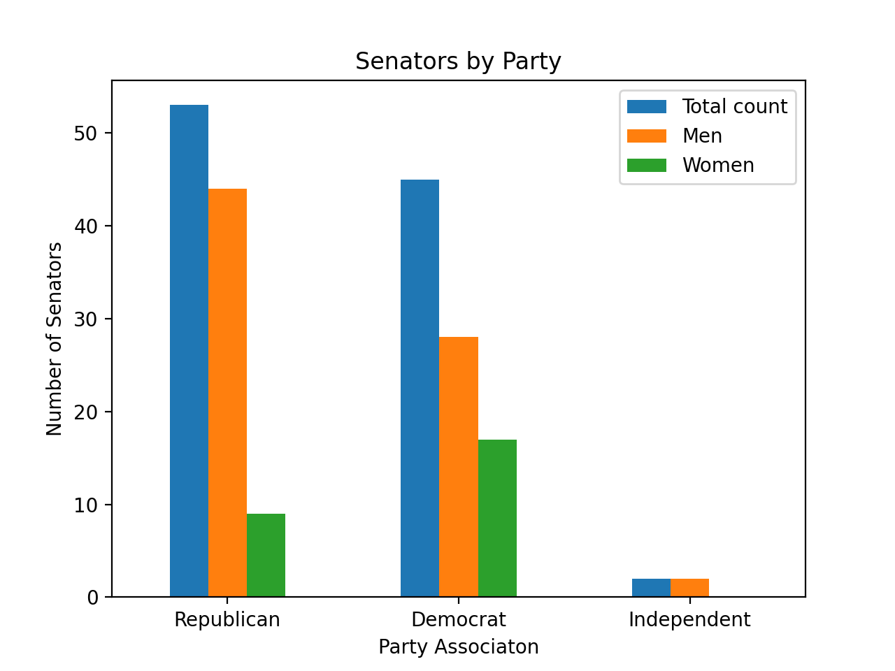
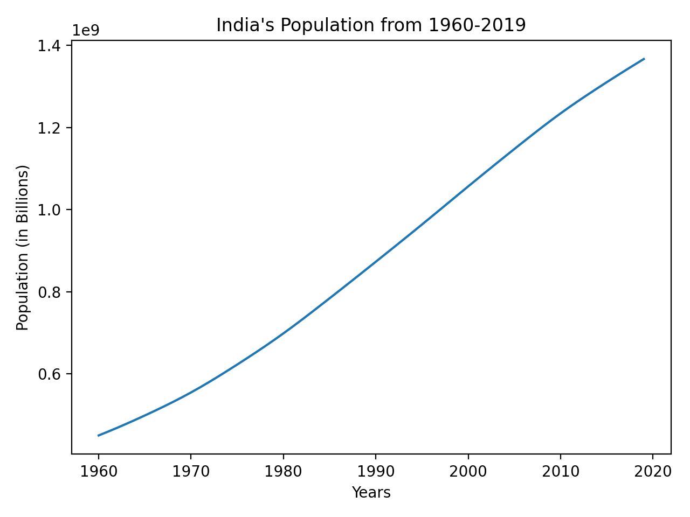

# Homework 2 Project
## United States Government

<addr> This graph illustrates the partisan breakdown of our Senate. Currently, the majority of our Senators are Republican and only two members of the Senate are Independent. </addr>

## India

